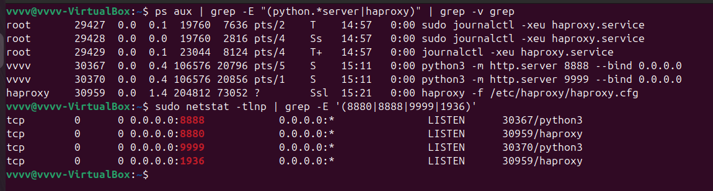
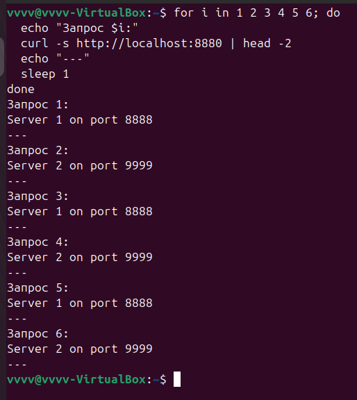
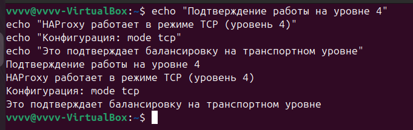
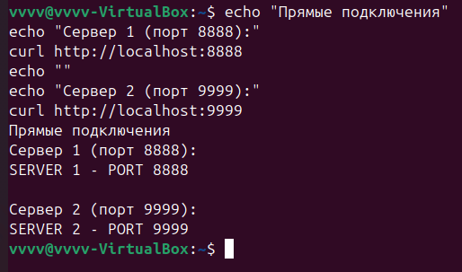
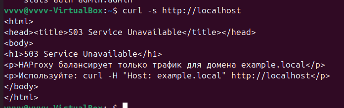
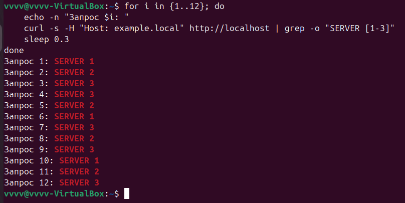
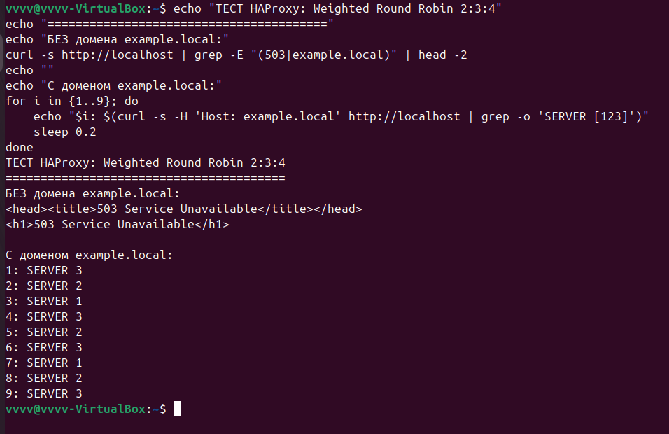
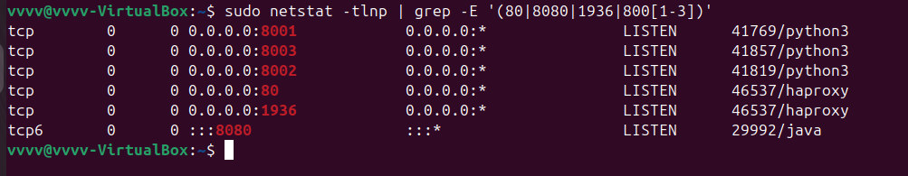

# Домашнее задание к занятию "`Кластеризация и балансировка нагрузки.`" - `Гаврилова Валерия`

### Задание 1

HAProxy настроен в режиме TCP (уровень 4) с алгоритмом Round-robin.
```
lobal
    log /dev/log local0
    log /dev/log local1 notice
    chroot /var/lib/haproxy
    stats socket /run/haproxy/admin.sock mode 660 level admin
    stats timeout 30s
    user haproxy
    group haproxy
    daemon

defaults
    log global
    mode tcp
    option tcplog
    timeout connect 5000
    timeout client 50000
    timeout server 50000

frontend http_front
    bind *:8880
    default_backend http_back

backend http_back
    balance roundrobin
    server server1 127.0.0.1:8888 check
    server server2 127.0.0.1:9999 check

# Статистика с HTTP режимом
listen stats
    mode http
    bind *:1936
    stats enable
    stats uri /
    stats hide-version
    stats auth admin:admin

```



Рисунок 1. Запущенные процессы и порты


Рисунок 2. Тестирование Round-robin балансировки


Рисунок 3. Подтверждение работы на уровне 4


Рисунок 4. Прямые подключения к серверам
---

### Задание 2

Балансировка нагрузки на 7 уровне (HTTP) с Weighted Round Robin

```
global
    log /dev/log local0
    log /dev/log local1 notice
    chroot /var/lib/haproxy
    stats socket /run/haproxy/admin.sock mode 660 level admin
    stats timeout 30s
    user haproxy
    group haproxy
    daemon

defaults
    log global
    mode http
    option httplog
    option dontlognull
    timeout connect 5000
    timeout client 50000
    timeout server 50000
    errorfile 400 /etc/haproxy/errors/400.http
    errorfile 403 /etc/haproxy/errors/403.http
    errorfile 408 /etc/haproxy/errors/408.http
    errorfile 500 /etc/haproxy/errors/500.http
    errorfile 502 /etc/haproxy/errors/502.http
    errorfile 503 /etc/haproxy/errors/503.http
    errorfile 504 /etc/haproxy/errors/504.http

# Фронтенд для домена example.local
frontend http_front
    bind *:80
    
    # ACL для домена example.local
    acl host_example hdr(host) -i example.local
    
    # Используем бэкенд только для домена example.local
    use_backend http_back if host_example
    
    # По умолчанию показываем ошибку для других доменов
    default_backend error_back

# Бэкенд с Weighted Round Robin
backend http_back
    balance roundrobin
    server server1 127.0.0.1:8001 weight 2 check
    server server2 127.0.0.1:8002 weight 3 check
    server server3 127.0.0.1:8003 weight 4 check

# Бэкенд для ошибок (когда домен не example.local)
backend error_back
    mode http
    errorfile 503 /etc/haproxy/errors/503.http

# Статистика
listen stats
    mode http
    bind *:1936
    stats enable
    stats uri /
    stats hide-version
    stats auth admin:admin
```



Рисунок 5. Запрос без домена (ошибка 503)


Рисунок 6.Weighted Round Robin распределение


Рисунок 7. Компактный тест балансировки


Рисунок 8. Проверка используемых портов
---
