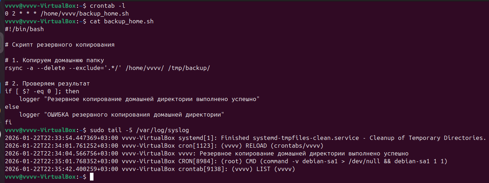
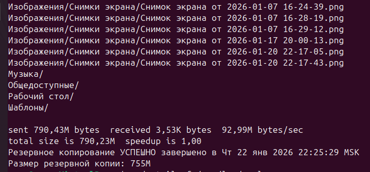

# Домашнее задание к занятию "`Резервное копирование`" - `Гаврилова Валерия`

### Задание 1


```
rsync -avh --checksum --exclude='.*/' /home/vvvv/ /tmp/backup/
```
На изображениях представлено начало и конец вывода данной команды


---

### Задание 2

Скрипт для резервного копировнаия
```
#!/bin/bash

# Cкрипт резервного копирования

# 1. Копируем домашнюю папку
rsync -a --delete --exclude='.*/' /home/vvvv/ /tmp/backup/

# 2. Проверяем результат
if [ $? -eq 0 ]; then
    logger "Резервное копирование домашней директории выполнено успешно"
else
    logger "ОШИБКА резервного копирования домашней директории"
fi

```

Содержимое команды crontab:
```
0 2 * * * /home/vvvv/backup_home.sh
```



Вывод команды с резервным копированием:

---