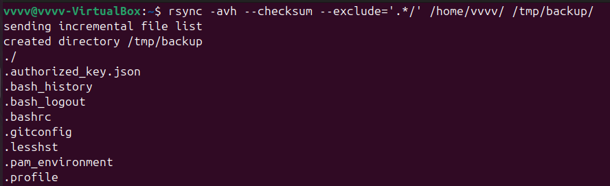
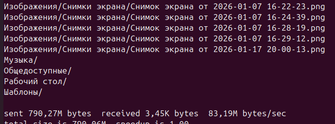

# Домашнее задание к занятию "`Резервное копирование`" - `Гаврилова Валерия`

### Задание 1


```
rsync -avh --checksum --exclude='.*/' /home/vvvv/ /tmp/backup/
```
На изображениях представлено начало и конец вывода данной команды



---

### Задание 2


