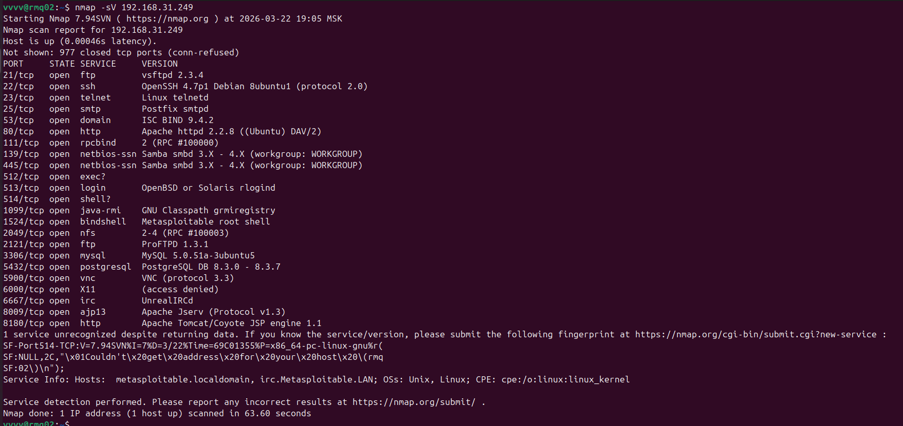
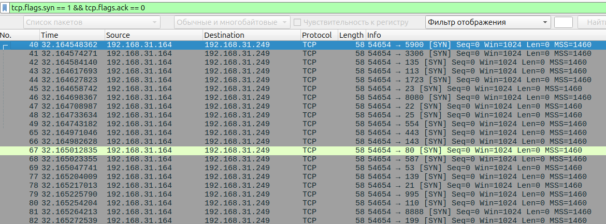
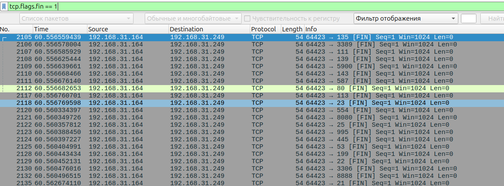
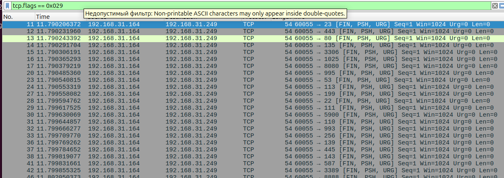
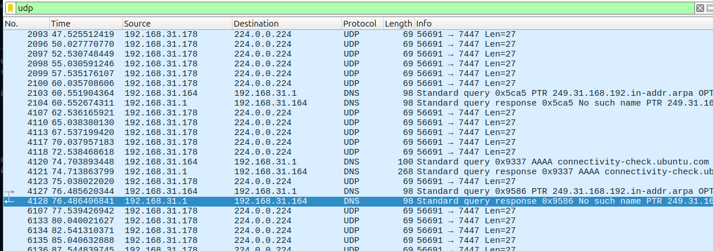

# Домашнее задание к занятию "`Уязвимости и атаки на информационные системы`" - `Гаврилова Валерия`

### Задание 1



Разрешенные сетевые службы:

Порт 21/tcp — FTP (vsftpd 2.3.4)

Порт 22/tcp — SSH (OpenSSH 4.7p1)

Порт 23/tcp — Telnet (Linux telnetd)

Порт 25/tcp — SMTP (Postfix smtpd)

Порт 53/tcp — DNS (ISC BIND 9.4.2)

Порт 80/tcp — HTTP (Apache httpd 2.2.8)

Порт 111/tcp — RPC (rpcbind 2)

Порт 139/tcp — NetBIOS (Samba smbd 3.X-4.X)

Порт 445/tcp — SMB (Samba smbd 3.X-4.X)

Порт 512/tcp — exec (rexecd)

Порт 513/tcp — login (rlogind)

Порт 514/tcp — shell (rshd)

Порт 1099/tcp — Java RMI (GNU Classpath grmiregistry)

Порт 1524/tcp — bindshell (Metasploitable root shell)

Порт 2049/tcp — NFS (Network File System 2-4)

Порт 2121/tcp — FTP (ProFTPD 1.3.1)

Порт 3306/tcp — MySQL (MySQL 5.0.51a)

Порт 5432/tcp — PostgreSQL (PostgreSQL 8.3.0-8.3.7)

Порт 5900/tcp — VNC (VNC protocol 3.3)

Порт 6000/tcp — X11 (X Window System)

Порт 6667/tcp — IRC (UnrealIRCd)

Порт 8009/tcp — AJP (Apache Jserv Protocol v1.3)

Порт 8180/tcp — HTTP (Apache Tomcat/Coyote JSP engine 1.1)

На основе этих версий служб, найдено три критических уязвимости:
Уязвимость 1: vsftpd 2.3.4 - Backdoor Command Execution
Версия FTP-сервера vsftpd 2.3.4 содержит бэкдор. При отправке имени пользователя, содержащего символы ":)", на 21-й порт, открывается командная оболочка на порту 6200, позволяющая выполнить произвольные команды с правами root.

Ссылка на Exploit-DB: https://www.exploit-db.com/exploits/17491

Уязвимость 2: UnrealIRCd 3.2.8.1 - Backdoor Command Execution
IRC-сервер UnrealIRCd версии 3.2.8.1 содержит бэкдор, внедренный в исходный код. Отправка специально сформированной команды "AB;" позволяет выполнить произвольные системные команды на сервере.

Ссылка на Exploit-DB: https://www.exploit-db.com/exploits/16922

Уязвимость 3: Samba 3.0.20 - Usermap Script Command Execution
Samba версии 3.0.20 (определяется по версии в Metasploitable) содержит уязвимость, позволяющую выполнить произвольные команды с правами root через отправку специально сформированного запроса к службе SMB. Известна как "usermap script" уязвимость.

Ссылка на Exploit-DB: https://www.exploit-db.com/exploits/16320

Сканирование показало, что на системе открыто 23 порта, на которых работают различные сетевые службы, включая FTP (vsftpd 2.3.4), SSH (OpenSSH 4.7p1), Telnet, HTTP (Apache 2.2.8), Samba, MySQL, PostgreSQL, VNC и IRC (UnrealIRCd). Многие из этих служб используют устаревшие версии программного обеспечения, что делает систему уязвимой.

---

### Задание 2

Команды для сканирования
```
# SYN-сканирование (полуоткрытое)
sudo nmap -sS 192.168.31.249

# FIN-сканирование
sudo nmap -sF 192.168.31.249

# Xmas-сканирование (Christmas Tree)
sudo nmap -sX 192.168.31.249

# UDP-сканирование
sudo nmap -sU 192.168.31.249
```
SYN-сканирование (-sS) отправляет TCP-пакеты с установленным флагом SYN.
Особенности трафика: техника "полуоткрытого" (half-open) сканирования, незавершает полное TCP-соединение, после получения SYN/ACK отправляет RST для разрыва соединения, самый популярный и быстрый режим сканирования

Wireshark фильтр: tcp.flags.syn == 1 && tcp.flags.ack == 0

 

FIN-сканирование (-sF) отправляет TCP-пакеты с установленным только флагом FIN.
Особенности трафика: использует нестандартную комбинацию флагов, FIN обычно используется для завершения установленного соединения, отправляется без предварительного установления соединения

Wireshark фильтр: tcp.flags.fin == 1



Xmas-сканирование (-sX) отправляет TCP-пакеты с установленными флагами FIN, PSH и URG одновременно.
Особенности трафика: название происходит от "рождественской елки" — много "горящих" флагов, отправляет явно "неправильный" TCP-пакет с точки зрения RFC, комбинация FIN+PSH+URG в реальном трафике практически не встречается 

Wireshark фильтр: tcp.flags == 0x029



UDP-сканирование (-sU) отправляет UDP-дейтаграммы.

Особенности трафика: UDP — протокол без установления соединения (connectionless), для сканирования отправляются пустые UDP-пакеты или с протокол-специфичной нагрузкой, работает медленнее TCP-сканирования из-за ограничений ICMP 

Wireshark фильтр: udp



Характер ответа сервера зависит от состояния порта и используемого режима сканирования. При SYN-сканировании открытый порт отвечает SYN/ACK, закрытый — RST. При FIN и Xmas сканировании открытые порты (на UNIX-подобных системах, включая Metasploitable) игнорируют такие пакеты и не отправляют ответа, в то время как закрытые порты отвечают RST в соответствии с RFC 793. При UDP-сканировании закрытые порты возвращают ICMP-сообщение "Port Unreachable" (type 3, code 3), а открытые порты либо отвечают UDP-пакетом (если служба активна), либо не отвечают вовсе.

---