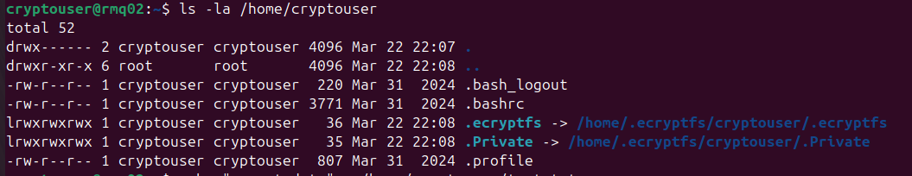
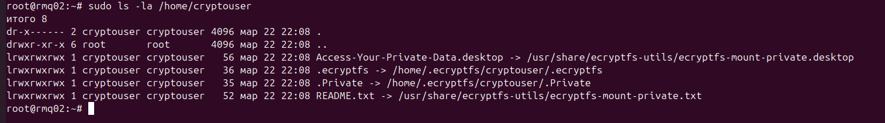
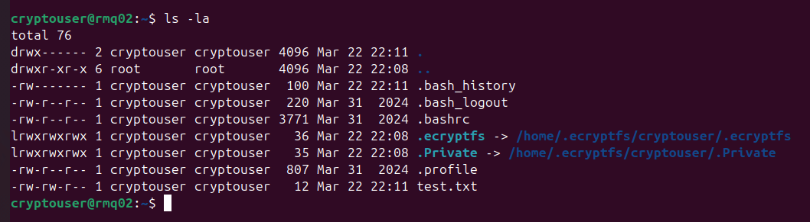
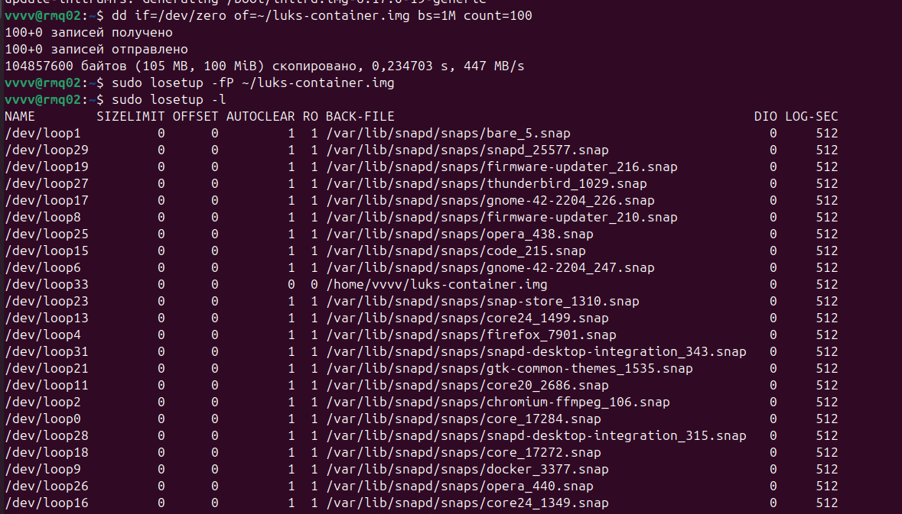
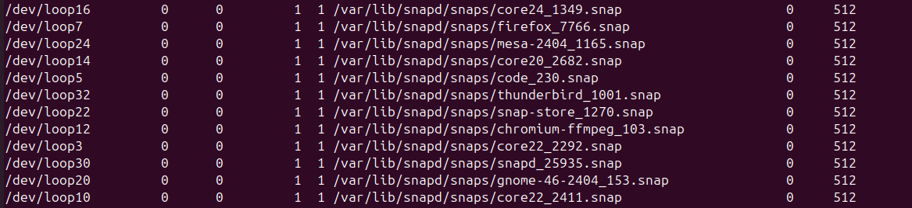
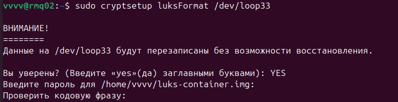
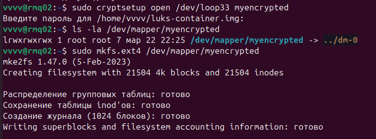
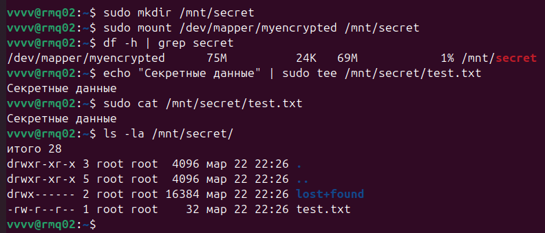
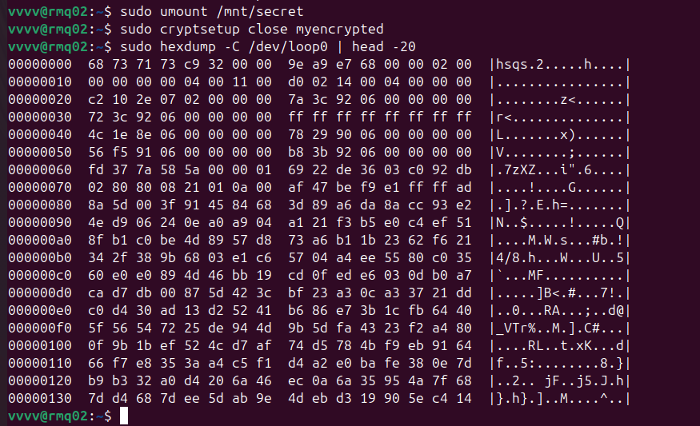

# Домашнее задание к занятию "`Защита хоста`" - `Гаврилова Валерия`

### Задание 1

```
sudo apt update
sudo apt install ecryptfs-utils -y
sudo useradd -m -s /bin/bash cryptouser
sudo passwd cryptouser
sudo pkill -u cryptouser
sudo ecryptfs-migrate-home -u cryptouser
sudo login
 # логин: cryptouser
 # пароль: ...
ls -la /home/cryptouser
```
после создания пользователя, но до шифрования:


```
echo "secret data" > /home/cryptouser/test.txt
ls -la /home/cryptouser
sudo ls -la /home/cryptouser
```
после шифрования, из-под root:



вход под cryptouser после шифрования:


---

### Задание 2

```
sudo apt update
sudo apt install cryptsetup -y
dd if=/dev/zero of=~/luks-container.img bs=1M count=100
sudo losetup -fP ~/luks-container.img
sudo losetup -l
```
Создание контейнера/раздела




```
sudo cryptsetup luksFormat /dev/loop33
```
Инициализация LUKS



```
sudo cryptsetup open /dev/loop33 myencrypted
ls -la /dev/mapper/myencrypted
sudo mkfs.ext4 /dev/mapper/myencrypted
```
Открытие и создание ФС



```
sudo mkdir /mnt/secret
sudo mount /dev/mapper/myencrypted /mnt/secret
df -h | grep secret
echo "Секретные данные" | sudo tee /mnt/secret/test.txt
sudo cat /mnt/secret/test.txt
ls -la /mnt/secret/
```
Монтирование и создание файлов



```
sudo umount /mnt/secret
sudo cryptsetup close myencrypted
sudo hexdump -C /dev/loop0 | head -20
```
Демонстрация шифрования 

