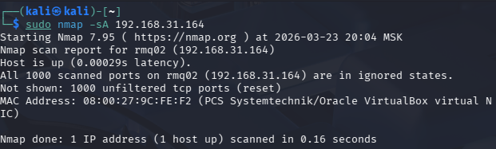
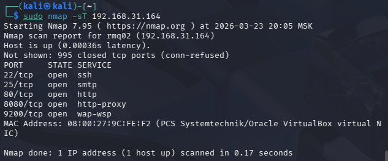
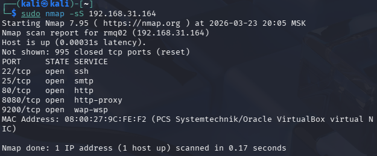
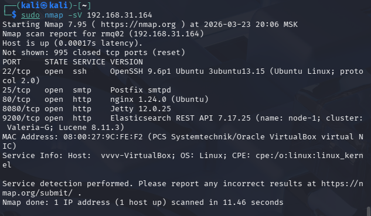
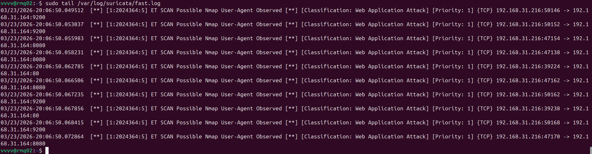
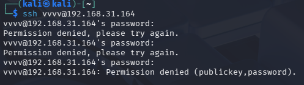
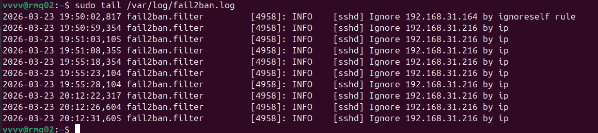

# Домашнее задание к занятию "`Защита сети`" - `Гаврилова Валерия`

### Задание 1

Защищаемая система (Ubuntu): IP-адрес 192.168.31.164
Система злоумышленника (Kali): IP-адрес 192.168.31.216

Все команды nmap выполнялись с Kali.

TCP ACK сканирование (-sA)
```
sudo nmap -sA 192.168.31.164
```


TCP Connect сканирование (-sT)
```
sudo nmap -sT 192.168.31.164
```


TCP SYN сканирование (-sS)
```
sudo nmap -sS 192.168.31.164
```


Определение версий служб (-sV)
```
sudo nmap -sV 192.168.31.164
```


На защищаемой системе открыты и доступны следующие сетевые службы:
- SSH (22) – OpenSSH 9.6p1
- SMTP (25) – Postfix
- HTTP (80) – nginx 1.24.0
- HTTP (8080) – Jetty 12.0.25
- HTTP (9200) – Elasticsearch REST API 7.17.25

События в логах Suricata
После выполнения всех типов сканирования в логе /var/log/suricata/fast.log появились следующие события:



Suricata сработала на правило ET SCAN Possible Nmap User-Agent Observed, которое детектирует характерный User-Agent, который Nmap использует при HTTP-сканировании и другие  признаки. Все алерты указывают на то, что с IP-адреса 192.168.31.216 (Kali) проводится сканирование портов (80, 8080, 9200). Классификация «Web Application Attack» и высокий приоритет (1) говорят о том, что IDS расценивает действия как подготовку к атаке.

События в логах Fail2Ban:
При простом сканировании nmap Fail2Ban не срабатывает, так как он реагирует только на неудачные попытки аутентификации. Однако при тестировании защиты SSH были выполнены три последовательные попытки входа с неверным паролем с Kali:
```
ssh vvvv@192.168.31.164
```


В логе /var/log/fail2ban.log зафиксировано:



Fail2Ban отслеживает логи аутентификации (/var/log/auth.log). После трёх неудачных попыток входа по SSH (параметр maxretry = 3 в настройках jail sshd) IP-адрес атакующего был автоматически заблокирован на уровне iptables на время, указанное в bantime (3600 секунд). Это демонстрирует работу Fail2Ban как инструмента активной защиты от брутфорс-атак.