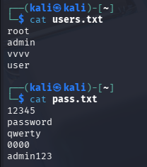
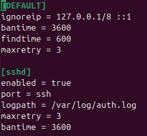
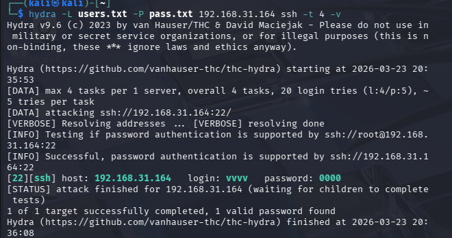
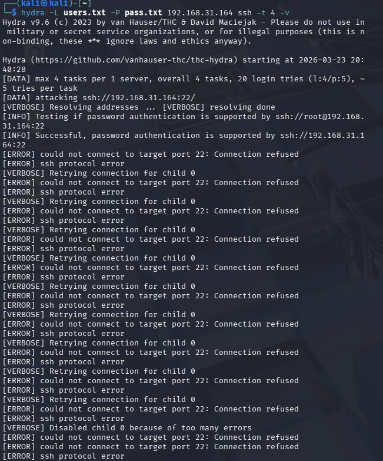
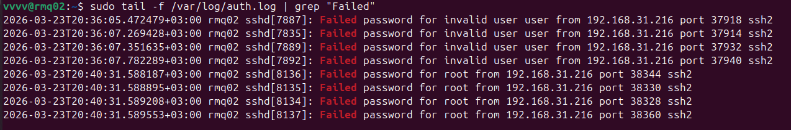
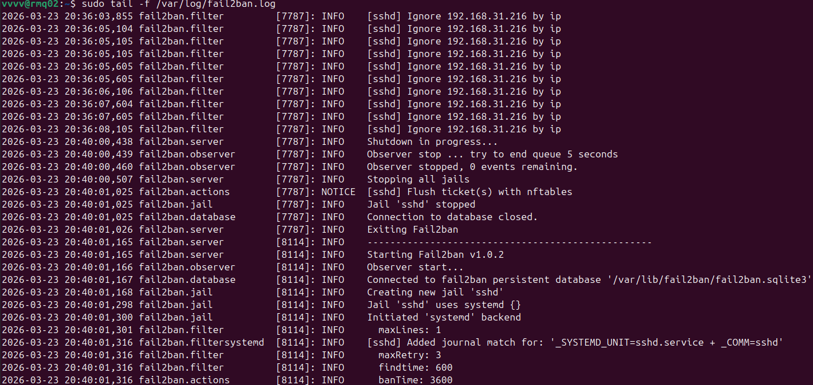
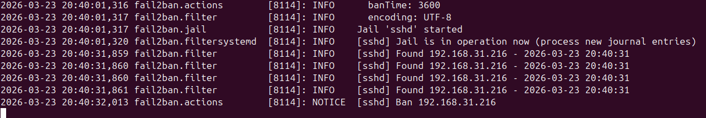
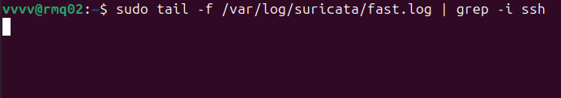
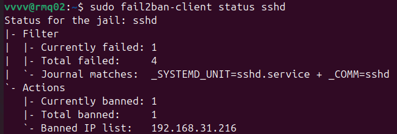

# Домашнее задание к занятию "`Защита сети`" - `Гаврилова Валерия`

### Задание 1

Защищаемая система (Ubuntu): IP-адрес 192.168.31.164
Система злоумышленника (Kali): IP-адрес 192.168.31.216

Все команды nmap выполнялись с Kali.

TCP ACK сканирование (-sA)
```
sudo nmap -sA 192.168.31.164
```


TCP Connect сканирование (-sT)
```
sudo nmap -sT 192.168.31.164
```


TCP SYN сканирование (-sS)
```
sudo nmap -sS 192.168.31.164
```


Определение версий служб (-sV)
```
sudo nmap -sV 192.168.31.164
```


На защищаемой системе открыты и доступны следующие сетевые службы:
- SSH (22) – OpenSSH 9.6p1
- SMTP (25) – Postfix
- HTTP (80) – nginx 1.24.0
- HTTP (8080) – Jetty 12.0.25
- HTTP (9200) – Elasticsearch REST API 7.17.25

События в логах Suricata
После выполнения всех типов сканирования в логе /var/log/suricata/fast.log появились следующие события:


Suricata сработала на правило ET SCAN Possible Nmap User-Agent Observed, которое детектирует характерный User-Agent Nmap  другие  признаки сканирования. Все алерты указывают на то, что с IP-адреса 192.168.31.216 (Kali) проводится сканирование портов (80, 8080, 9200). Классификация «Web Application Attack» и высокий приоритет (1) говорят о том, что IDS расценивает действия как подготовку к атаке.

События в логах Fail2Ban:
При простом сканировании nmap Fail2Ban не срабатывает, так как он реагирует только на неудачные попытки аутентификации. Однако при тестировании защиты SSH были выполнены три последовательные попытки входа с неверным паролем с Kali:
```
ssh vvvv@192.168.31.164
```


В логе /var/log/fail2ban.log зафиксировано:


Fail2Ban отслеживает логи аутентификации (/var/log/auth.log). После трёх неудачных попыток входа по SSH (параметр maxretry = 3 в настройках jail sshd) IP-адрес атакующего был автоматически заблокирован на уровне iptables на время, указанное в bantime (3600 секунд). Это демонстрирует работу Fail2Ban как инструмента активной защиты от брутфорс-атак.

---


### Задание 2
Атака на подбор пароля SSH
Подготовка файлов для Hydra:
 Содержимое users.txt и pass.txt:



Настройка Fail2:
Конфигурация /etc/fail2ban/jail.local:
```
[DEFAULT]
ignoreip = 127.0.0.1/8 ::1
bantime = 3600
findtime = 600
maxretry = 3

[sshd]
enabled = true
port = ssh
logpath = /var/log/auth.log
maxretry = 3
bantime = 3600
```


Проведение атаки Hydra
```
hydra -L users.txt -P pass.txt 192.168.31.164 ssh -t 4 -v
```
до бана:



после бана:



Мониторинг логов
- Лог аутентификации
```
sudo tail -f /var/log/auth.log | grep "Failed"
```


- Лог Fail2Ban
```
sudo tail -f /var/log/fail2ban.log
```



- Лог Suricata
```
sudo tail -f /var/log/suricata/fast.log | grep -i ssh
```


Проверка бана
```
sudo fail2ban-client status sshd
```


Hydra выполнила перебор логинов и паролей по SSH. В файлах users.txt и pass.txt были указаны 4 логина и 5 паролей.
После 4 неудачных попыток входа (для пользователя root) с IP-адреса 192.168.31.216 (Kali) Fail2Ban зафиксировал события в логе /var/log/fail2ban.log и заблокировал IP-адрес атакующего. Блокировка была выполнена на уровне iptables на 3600 секунд (настройка bantime). После этого Hydra не смогла продолжить атаку, получив ошибку Connection refused.
В логах Suricata не зафиксировано специфических алертов для SSH-брутфорса, так как стандартные правила направлены в первую очередь на обнаружение HTTP-сканирования. Однако ранее (в Задании 1) Suricata успешно детектировала сканирование портов с использованием Nmap, что демонстрирует её работоспособность как IDS.

---
