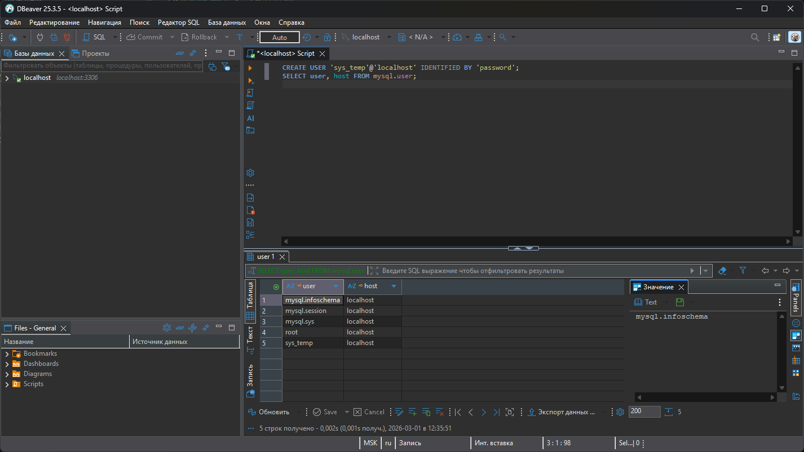
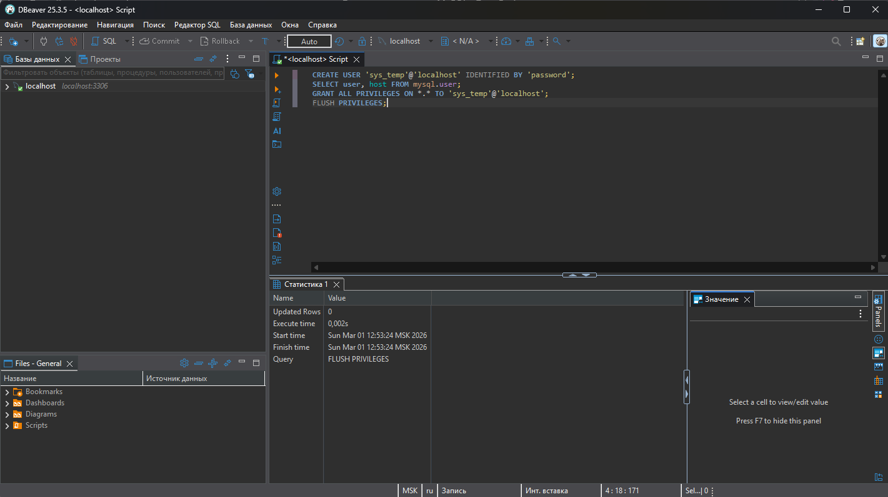
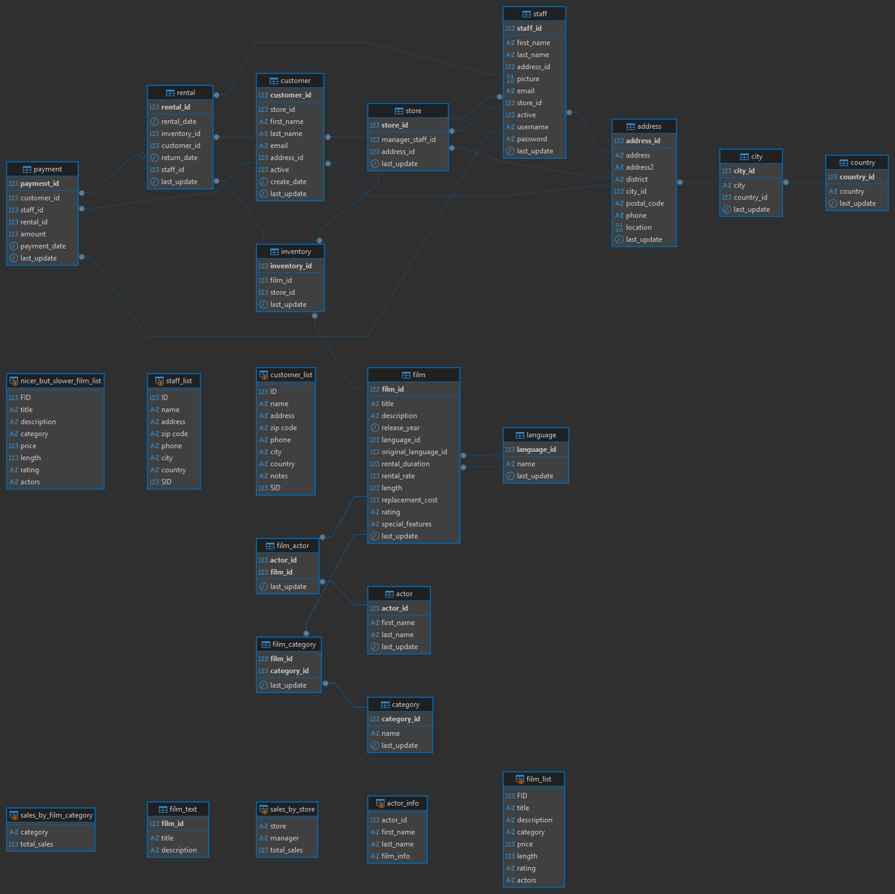
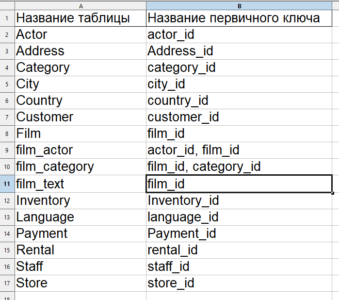
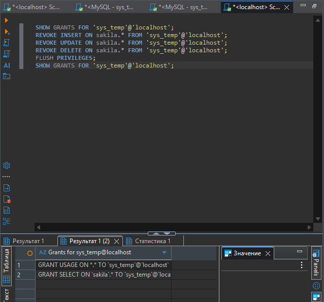

# Домашнее задание к занятию "`Работа с данными (DDL/DML)`" - `Гаврилова Валерия`

### Задание 1

 Мне пришлось все делать немного по альтернативному методу, ведь в процессе работы возникало много ошибок. (например, создание таблиц вручную, т.к скрипт выдавал ошибки, плюсом были дополнительные проверки.)

```
CREATE USER 'sys_temp'@'localhost' IDENTIFIED BY 'password';
SELECT user, host FROM mysql.user;
GRANT ALL PRIVILEGES ON *.* TO 'sys_temp'@'localhost' WITH GRANT OPTION;
FLUSH PRIVILEGES;
SHOW GRANTS FOR 'sys_temp'@'localhost';
ALTER USER 'sys_temp'@'localhost' IDENTIFIED WITH mysql_native_password BY 'password';
FLUSH PRIVILEGES;
CREATE DATABASE IF NOT EXISTS sakila;
USE sakila;
USE sakila;
SHOW TABLES;
DESCRIBE actor;
DESCRIBE film;
DESCRIBE customer;
SELECT COUNT(*) FROM actor;
SELECT COUNT(*) FROM film;
SELECT COUNT(*) FROM customer;
```

Результат запроса, где в списке виден созданный пользователь sys_temp



Выдача и проверка всех прав у пользователя



ER-диаграммa базы данных sakila


---

### Задание 2

Таблица с первичными ключами (регистр везде должен быть низким, но к сожалению этого не везде удалось добиться.)


---

### Задание 3

```
SHOW GRANTS FOR 'sys_temp'@'localhost';
REVOKE INSERT ON sakila.* FROM 'sys_temp'@'localhost';
REVOKE UPDATE ON sakila.* FROM 'sys_temp'@'localhost';
REVOKE DELETE ON sakila.* FROM 'sys_temp'@'localhost';
FLUSH PRIVILEGES;
SHOW GRANTS FOR 'sys_temp'@'localhost';
```
Результат выполнения удаления прав у пользователя


---
