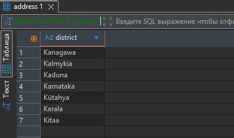
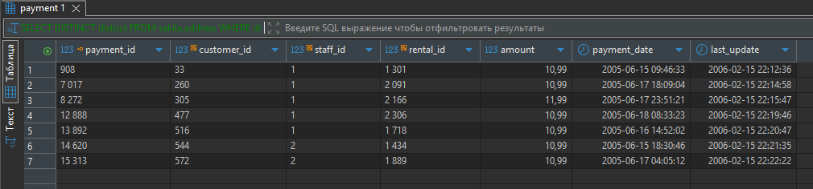
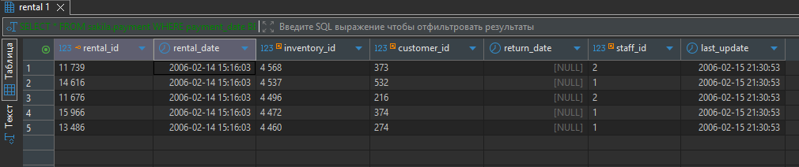
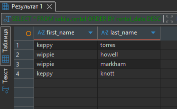
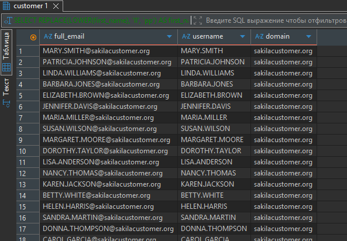
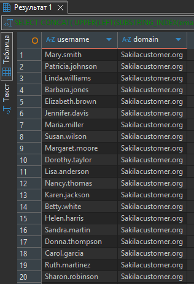

# Домашнее задание к занятию "`Операции с данными в SQL`" - `Гаврилова Валерия`

### Задание 1

```
SELECT DISTINCT district
FROM sakila.address
WHERE district LIKE 'K%a'
  AND district NOT LIKE '% %';
```


---

### Задание 2

```
SELECT *
FROM sakila.payment
WHERE payment_date BETWEEN '2005-06-15' AND '2005-06-18 23:59:59'
  AND amount > 10.00;
```

---

### Задание 3

```
SELECT *
FROM sakila.rental
ORDER BY rental_date DESC
LIMIT 5;
```

---

### Задание 4

```
SELECT 
    REPLACE(LOWER(first_name), 'll', 'pp') AS first_name,
    LOWER(last_name) AS last_name
FROM sakila.customer
WHERE first_name IN ('Kelly', 'Willie')
  AND active = 1;
```

---
### Задание 5

```
SELECT 
    email AS full_email,
    SUBSTRING_INDEX(email, '@', 1) AS username,
    SUBSTRING_INDEX(email, '@', -1) AS domain
FROM sakila.customer;
```

---

### Задание 6

```
SELECT 
    -- Преобразуем часть до @
    CONCAT(
        UPPER(LEFT(SUBSTRING_INDEX(email, '@', 1), 1)),
        LOWER(SUBSTRING(SUBSTRING_INDEX(email, '@', 1), 2))
    ) AS username,
    
    -- Преобразуем часть после @
    CONCAT(
        UPPER(LEFT(SUBSTRING_INDEX(email, '@', -1), 1)),
        LOWER(SUBSTRING(SUBSTRING_INDEX(email, '@', -1), 2))
    ) AS domain
FROM sakila.customer;
```

---