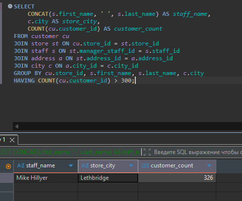
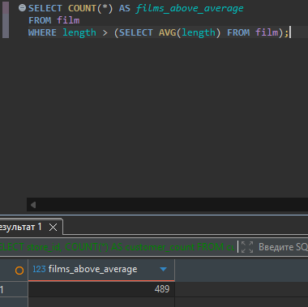
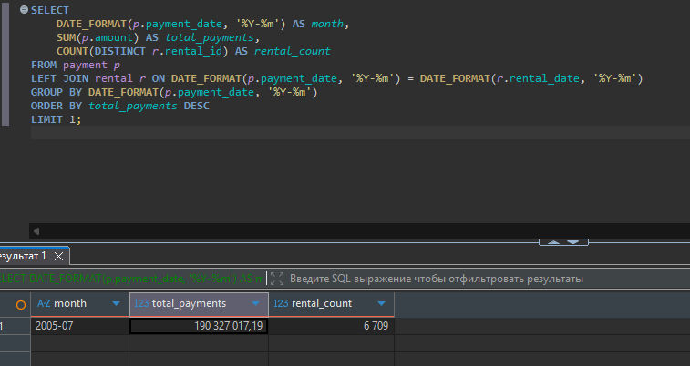

# Домашнее задание к занятию "`SQL. Часть 2`" - `Гаврилова Валерия`

### Задание 1

```
SELECT 
    CONCAT(s.first_name, ' ', s.last_name) AS staff_name,
    c.city AS store_city,
    COUNT(cu.customer_id) AS customer_count
FROM customer cu
JOIN store st ON cu.store_id = st.store_id
JOIN staff s ON st.manager_staff_id = s.staff_id
JOIN address a ON st.address_id = a.address_id
JOIN city c ON a.city_id = c.city_id
GROUP BY cu.store_id, s.first_name, s.last_name, c.city
HAVING COUNT(cu.customer_id) > 300;
```

---

### Задание 2

```
SELECT COUNT(*) AS films_above_average
FROM film
WHERE length > (SELECT AVG(length) FROM film);
```


---

### Задание 3

```
SELECT 
    DATE_FORMAT(p.payment_date, '%Y-%m') AS month,
    SUM(p.amount) AS total_payments,
    COUNT(DISTINCT r.rental_id) AS rental_count
FROM payment p
LEFT JOIN rental r ON DATE_FORMAT(p.payment_date, '%Y-%m') = DATE_FORMAT(r.rental_date, '%Y-%m')
GROUP BY DATE_FORMAT(p.payment_date, '%Y-%m')
ORDER BY total_payments DESC
LIMIT 1;
```

---