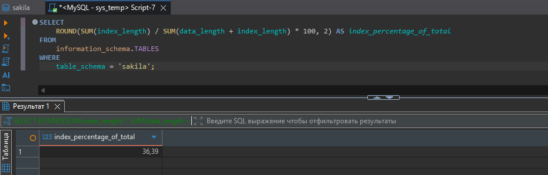
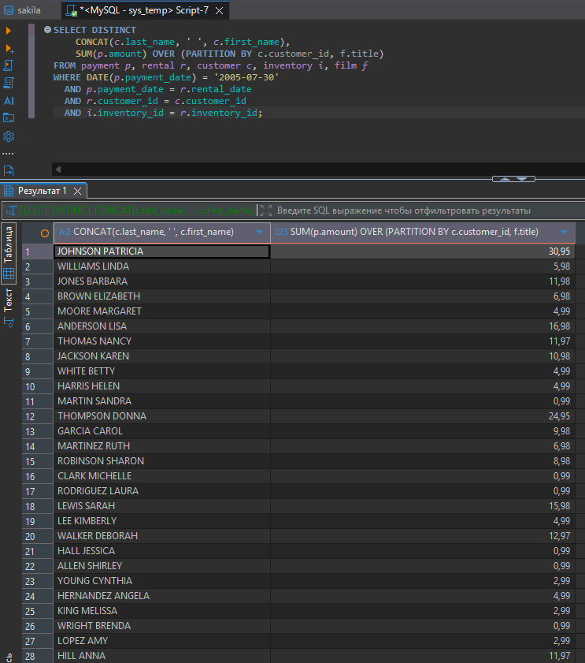
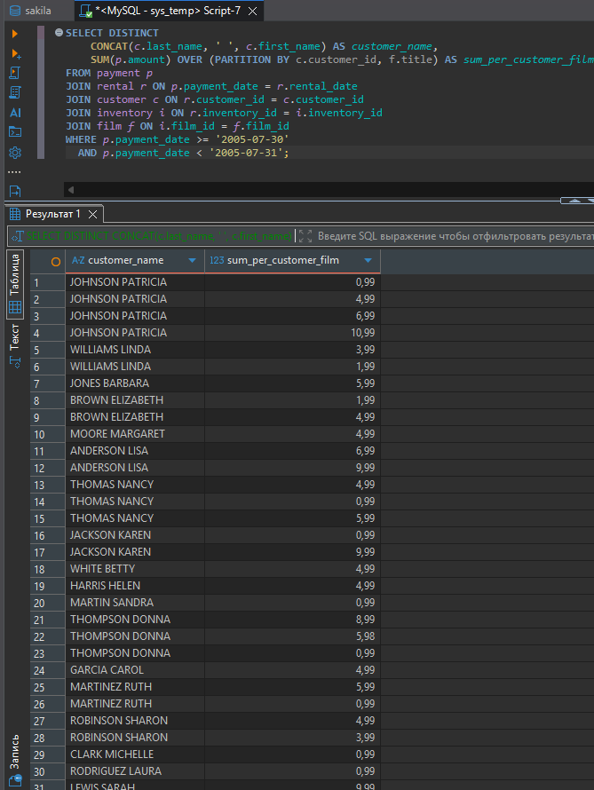

# Домашнее задание к занятию "`Индексы`" - `Гаврилова Валерия`

### Задание 1

```
SELECT 
    ROUND(SUM(index_length) / SUM(data_length + index_length) * 100, 2) AS index_percentage_of_total
FROM 
    information_schema.TABLES
WHERE 
    table_schema = 'sakila';
```


---

### Задание 2

Исходный запрос:



Узкие места (по explain analyze)
1: DATE(p.payment_date) = '2005-07-30'
- Функция DATE() на столбце отключает использование индекса
- Индекс на payment_date не будет использован
- Будет полное сканирование таблицы payment

2: Неявные CROSS JOIN (старый синтаксис)
- Запрос использует FROM t1, t2, t3, t4, t5 без явных JOIN
- MySQL сначала строит декартово произведение, потом фильтрует
- Огромная временная таблица

3: DISTINCT + оконная функция
- DISTINCT применяется после вычисления оконной функции
- Создаётся временная таблица с дубликатами, затем она сортируется для удаления дубликатов
- Оконная функция SUM(...) OVER (...) может давать одинаковые значения для многих строк

4: Отсутствие связи с film
- film (f.title) используется только в PARTITION BY
- Нет условия JOIN между inventory и film
- Ещё один скрытый CROSS JOIN

5: Сравнение payment_date = rental_date
- Вероятно, нужно сравнивать payment_date с rental_date по полной дате+времени
- В условии выше уже есть фильтр по дате, но точное совпадение может не сработать

Оптимизированный запрос:
```
SELECT DISTINCT 
    CONCAT(c.last_name, ' ', c.first_name) AS customer_name,
    SUM(p.amount) OVER (PARTITION BY c.customer_id, f.title) AS sum_per_customer_film
FROM payment p
JOIN rental r ON p.payment_date = r.rental_date
JOIN customer c ON r.customer_id = c.customer_id
JOIN inventory i ON r.inventory_id = i.inventory_id
JOIN film f ON i.film_id = f.film_id
WHERE p.payment_date >= '2005-07-30' 
  AND p.payment_date < '2005-07-31';
```



DATE(p.payment_date) = - Заменено на диапазон >= '2005-07-30' AND < '2005-07-31' — индекс будет использован
Неявный CROSS JOIN заменён на явный JOIN ... ON
Отсутствие связи inventory → film - Добавлен JOIN film f ON i.film_id = f.film_id
Оконная функция без необходимости - оставлена, но теперь корректно считает
DISTINCT - Пока оставлен, но можно убрать, если данные уникальны

Выводы:
Узкие места:
- Использование DATE(column) — индекс не работает
- Старый синтаксис JOIN (декартово произведение)
- Отсутствие связи с таблицей film
- DISTINCT + оконная функция создают лишние временные таблицы

Оптимизация:
- Заменить DATE(payment_date) = на диапазон >= date AND < date + 1
- Переписать на явный JOIN ... ON
- Добавить связь inventory → film
- По необходимости добавить индексы на внешние ключи

---