# Домашнее задание к занятию "`Репликация и масштабирование. Часть 1`" - `Гаврилова Валерия`

### Задание 1

Master-Slave: 
Его суть в том, что есть один главный сервер (Master), который принимает все запросы на запись (добавление, изменение данных). Он передает изменения подчиненным серверам (Slaves). Slave-серверы же работают только на чтение данных. Они являются «копиями» мастера.
Эта репликация хорошо подходит для распределения нагрузки (чтение идет с нескольких серверов) и создания резервных копий, но если Master выйдет из строя, запись данных остановится, пока не назначить новый мастер вручную или автоматически.

Master-Master:
Его суть такова, что оба сервера являются главными. Каждый из них принимает запросы и на запись, и на чтение. Они постоянно синхронизируются друг с другом.
В этой схеме высокая отказоустойчивость (если один упал, запись идет через второй) и возможность писать в оба сервера (например, если пользователи физически находятся в разных регионах), но есть сложность в настройке и риск конфликтов (если одновременно изменить одну и ту же запись на обоих серверах).

Главное же отличие в том, что в схеме Master-Slave писать можно только в одну базу и читать — со многих, а в схеме Master-Master можно писать (и читать) сразу в оба сервера.

### Задание 2

docker-compose.yml:
```
version: '3.8'
services:
  mysql-master:
    image: mysql:8.0
    container_name: mysql-master
    environment:
      MYSQL_ROOT_PASSWORD: rootpassword
      MYSQL_DATABASE: testdb
    ports:
      - "3306:3306"
    command: >
      --server-id=1
      --log-bin=mysql-bin
      --binlog-format=ROW
    networks:
      - mysql-network

  mysql-slave:
    image: mysql:8.0
    container_name: mysql-slave
    environment:
      MYSQL_ROOT_PASSWORD: rootpassword
    ports:
      - "3307:3306"
    command: >
      --server-id=2
      --relay-log=mysql-relay-bin
      --read-only=1
    networks:
      - mysql-network
    depends_on:
      - mysql-master

networks:
  mysql-network:
    driver: bridge
```
Результат запуска обоих контейнеров:


Потом нужно подключится к Master и создать пользователя для репликации
```
docker exec -it mysql-master mysql -u root -p
CREATE USER 'replication_user'@'%' IDENTIFIED WITH mysql_native_password BY 'replication_password';
GRANT REPLICATION SLAVE ON *.* TO 'replication_user'@'%';
FLUSH PRIVILEGES;
SHOW MASTER STATUS;
```

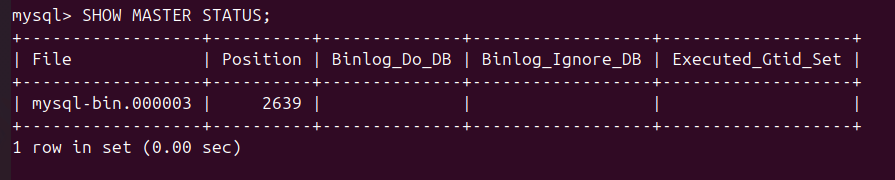

Затем идет подключение к Slave, его настройка подключения к Master и запуск. Пришлось также отключить SSL чтобы не было ошибок
```
docker exec -it mysql-slave mysql -u root -p
CHANGE MASTER TO
  MASTER_HOST='mysql-master',
  MASTER_USER='replication_user',
  MASTER_PASSWORD='replication_password',
  MASTER_LOG_FILE='mysql-bin.000003',  
  MASTER_LOG_POS=2639;    
  MASTER_SSL=0; 
START SLAVE;
SHOW SLAVE STATUS\G
```

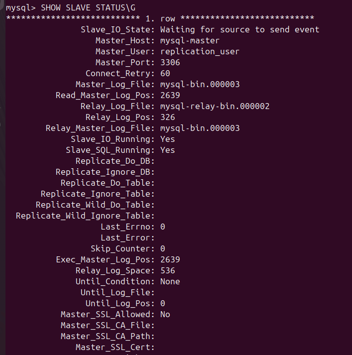
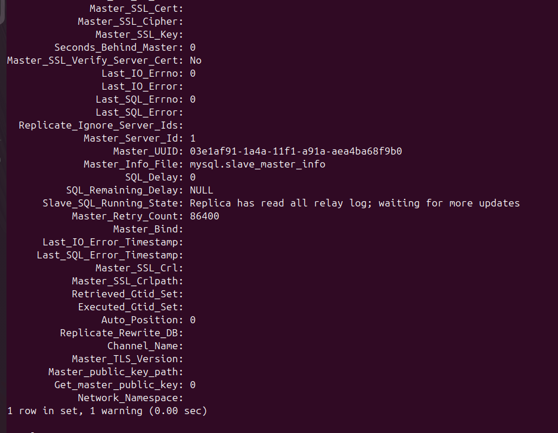

На Master создадим новых пользователей
```
USE test_replication;
SELECT * FROM users;
INSERT INTO users (name) VALUES ('Second User from Master');
INSERT INTO users (name) VALUES ('Third User from Master');
SELECT * FROM users;
```
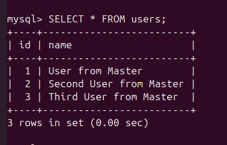

На Slave проверяем появились ли данные. В конечном итоге они совпадают с  Master
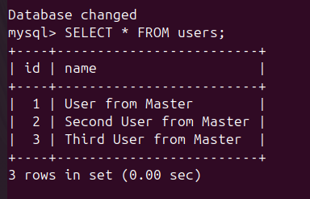

Попытка изменить данные на Slave
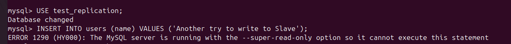

Финальный статус репликации
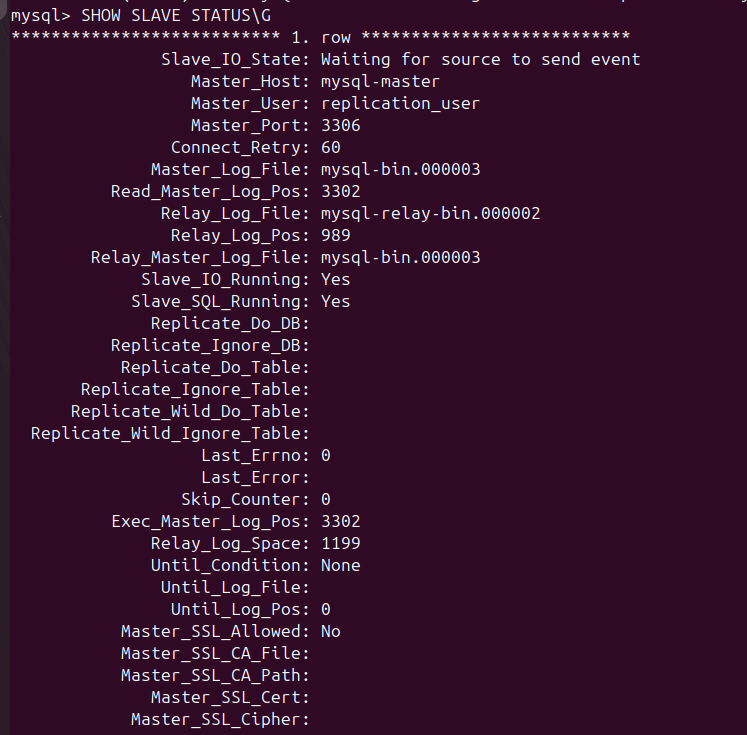
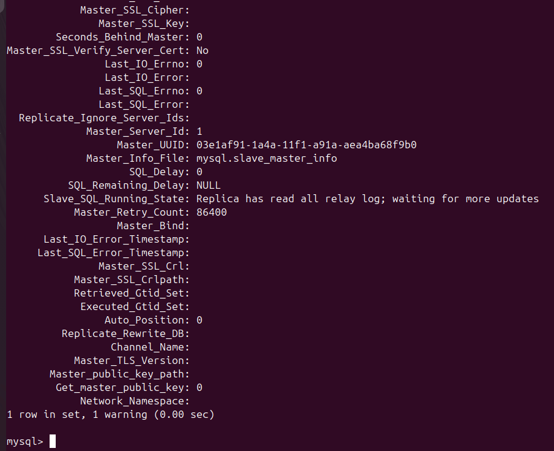
---

### Задание 3

docker-compose-master-master.yml
```
version: '3.8'
services:
  mysql-master1:
    image: mysql:8.0
    container_name: mysql-master1
    environment:
      MYSQL_ROOT_PASSWORD: rootpassword
      MYSQL_DATABASE: testdb
    ports:
      - "3306:3306"
    command: >
      --server-id=1
      --log-bin=mysql-bin
      --binlog-format=ROW
      --auto-increment-increment=2
      --auto-increment-offset=1
      --skip-host-cache
      --skip-name-resolve
    networks:
      - mysql-network

  mysql-master2:
    image: mysql:8.0
    container_name: mysql-master2
    environment:
      MYSQL_ROOT_PASSWORD: rootpassword
      MYSQL_DATABASE: testdb
    ports:
      - "3307:3306"
    command: >
      --server-id=2
      --log-bin=mysql-bin
      --binlog-format=ROW
      --auto-increment-increment=2
      --auto-increment-offset=2
      --skip-host-cache
      --skip-name-resolve
    networks:
      - mysql-network
    depends_on:
      - mysql-master1

networks:
  mysql-network:
    driver: bridge
```
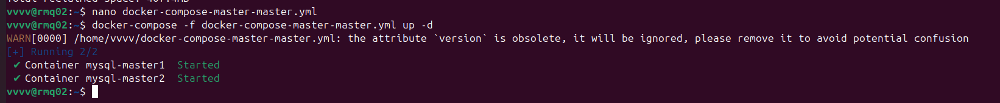

Создание пользователя для репликации в Master1:
```
CREATE USER 'replication_user'@'%' IDENTIFIED WITH mysql_native_password BY 'replication_password';
GRANT REPLICATION SLAVE ON *.* TO 'replication_user'@'%';
FLUSH PRIVILEGES;
```
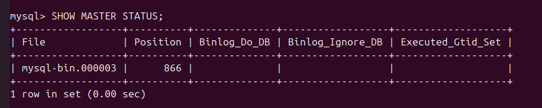

Создание пользователя для репликации в Master2 (Position у обоих оказался одинаковым, тк контейнеры все еще совершенно чистые):
```
CREATE USER 'replication_user'@'%' IDENTIFIED WITH mysql_native_password BY 'replication_password';
GRANT REPLICATION SLAVE ON *.* TO 'replication_user'@'%';
FLUSH PRIVILEGES;
SHOW MASTER STATUS;
```
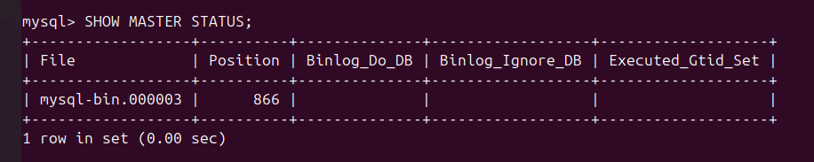

Настройка репликации master2 → master1
```
STOP SLAVE;
RESET SLAVE;
CHANGE MASTER TO
  MASTER_HOST='mysql-master2',
  MASTER_USER='replication_user',
  MASTER_PASSWORD='replication_password',
  MASTER_LOG_FILE='mysql-bin.000003',  -
  MASTER_LOG_POS=866,                   
  MASTER_SSL=0;
START SLAVE;
SHOW SLAVE STATUS\G
```
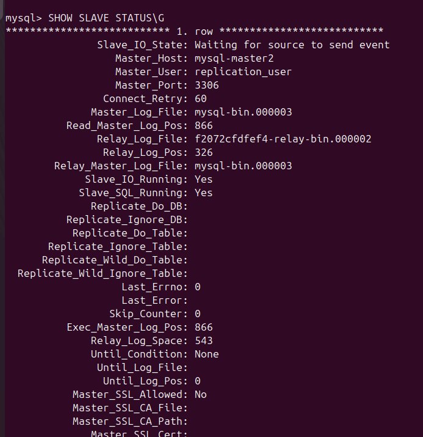
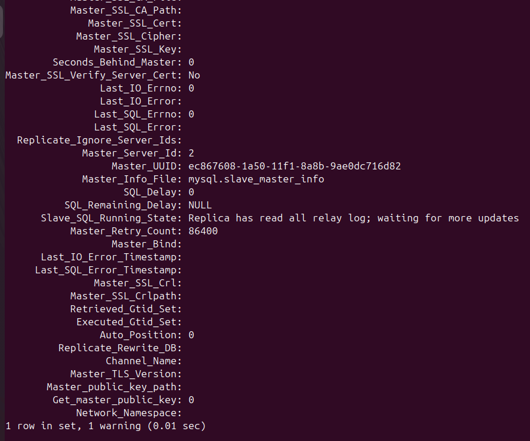

Настройка репликации master1 → master2
```
STOP SLAVE;
RESET SLAVE;
CHANGE MASTER TO
  MASTER_HOST='mysql-master1',
  MASTER_USER='replication_user',
  MASTER_PASSWORD='replication_password',
  MASTER_LOG_FILE='mysql-bin.000003',  
  MASTER_LOG_POS=866,                   
  MASTER_SSL=0;
START SLAVE;
SHOW SLAVE STATUS\G
```
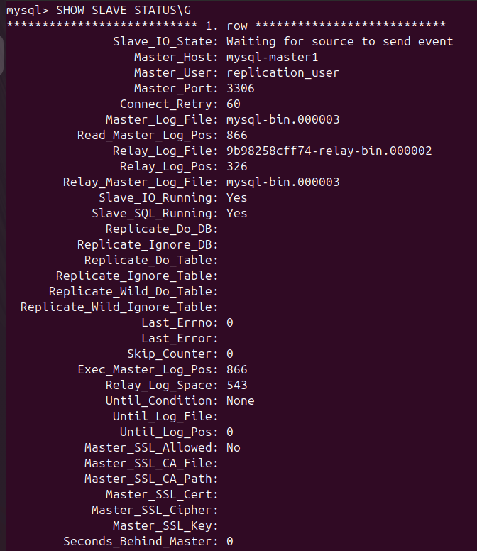
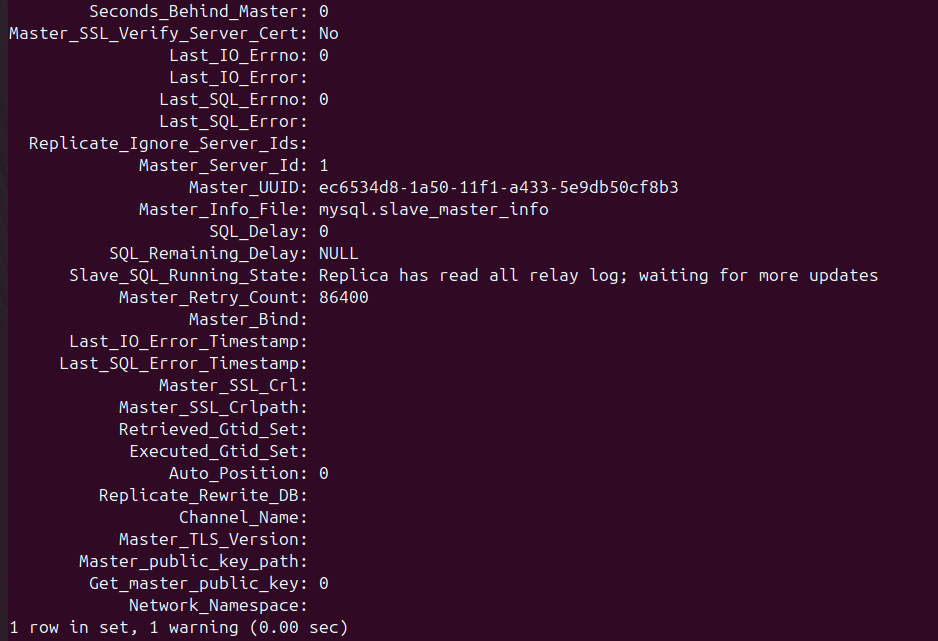

Тест записи на master1
```
CREATE DATABASE IF NOT EXISTS test_mm;
USE test_mm;
CREATE TABLE test_table (id INT AUTO_INCREMENT PRIMARY KEY, data VARCHAR(50), source VARCHAR(20));
INSERT INTO test_table (data, source) VALUES ('Data from Master1', 'master1');
SELECT * FROM test_table;
```
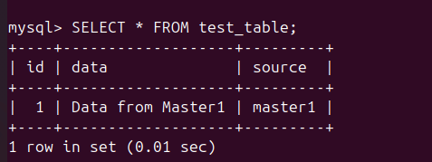

Проверка на master2
```
USE test_mm;
SELECT * FROM test_table;
```
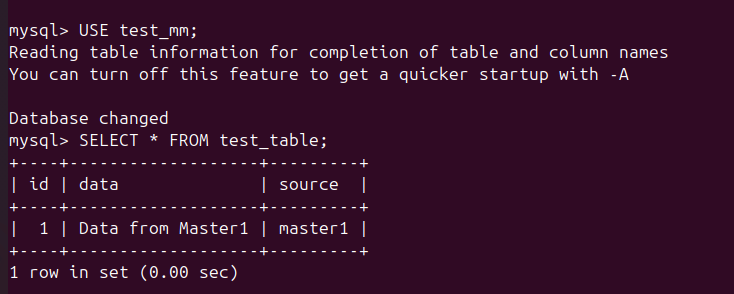

Тест записи на master2
```
INSERT INTO test_table (data, source) VALUES ('Data from Master2', 'master2');
SELECT * FROM test_table;
```
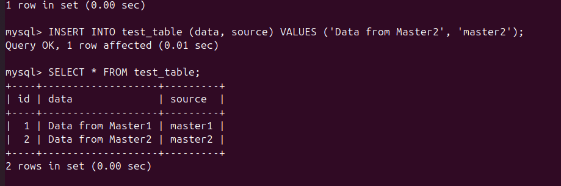

Проверка на master1
```
SELECT * FROM test_table;
```
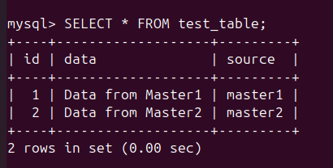

Проверка автоинкремента
На master1:
```
INSERT INTO test_table (data, source) VALUES ('Another from M1', 'master1');
INSERT INTO test_table (data, source) VALUES ('Another from M1 again', 'master1');
SELECT * FROM test_table ORDER BY id;
```
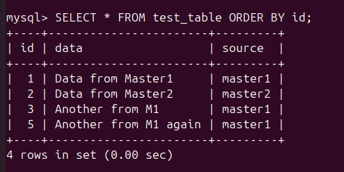

На master2:
```
INSERT INTO test_table (data, source) VALUES ('Another from M2', 'master2');
INSERT INTO test_table (data, source) VALUES ('Another from M2 again', 'master2');
SELECT * FROM test_table ORDER BY id;
```
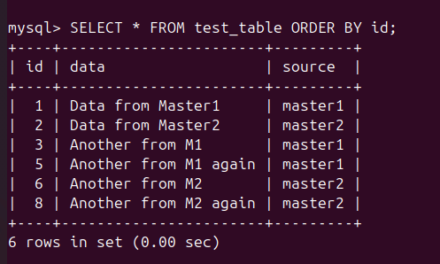
---