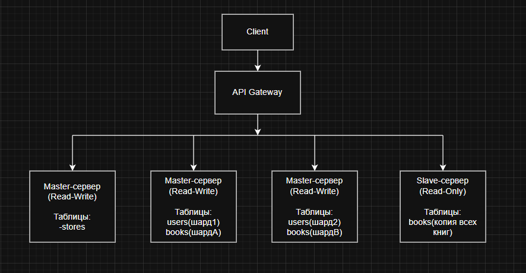

# Домашнее задание к занятию "`Репликация и масштабирование. Часть 2`" - `Гаврилова Валерия`

### Задание 1
Активный Master и пассивный Slave
Главный плюс — наличие отказоустойчивости - "горячей" замены. Если Master выходит из строя, роль берет на себя Slave, что минимизирует время простоя системы.
Slave можно использовать для создания резервных копий без нагрузки на основной сервер (можно "заморозить" Slave или отключить его на время бэкапа).

Master и несколько Slave-серверов
Позволяет распределить трафик чтения данных (SELECT запросы) между несколькими Slave-серверами. Это снимает нагрузку с основного Master'а, который занимается только записью (INSERT/UPDATE).
Легко увеличивать производительность системы просто добавляя новые Slave-серверы для обработки растущего количества запросов на чтение.
Разных Slave'ов можно использовать для разных задач (например, один для аналитики, другой для обычных пользовательских запросов), не мешая основной работе.

### Задание 2

<<<<<<< HEAD
Базы данных:
 user (ID, ФИО, email, пароль, дата регистрации). Отвечает за аутентификацию и профили.
 books (ID, ISBN, название, автор, жанр, год издания, аннотация). Отвечает за поиск и просмотр товаров.
 stores (ID, адрес, координаты, контакты, режим работы, остатки книг). Отвечает за наличие товара в точках продаж.

Вертикальный шардинг (делим по смыслу)
Разносим таблицы на разные сервера, чтобы они не мешали друг другу.
- Магазины (stores) выделены на отдельный сервер, так как они часто обновляются (изменение остатков, режима работы)
- Пользователи (users) и книги (books) распределены по серверам вместе для равномерного распределения нагрузки
Горизонтальный шардинг (делим большие таблицы на куски)
Так как пользователей и книг много, режем их на части по ID.

Пользователи (Users): Делим по id пользователя на два шарда (user_id % 2).
- Шард 1: users (id % 2 = 0)
- Шард 2: users (id % 2 = 1)

Книги (Books): Делим по id магазина (store_id) на три шарда:
- Шард A: книги для магазинов с id 1, 4, 7...
- Шард B: книги для магазинов с id 2, 5, 8...
- Шард C: книги для магазинов с id 3, 6, 9...

Схема расположения серверов:

Режимы работы серверов (для описания):
Сервер	    |Режим	            | Что хранит 
Master 1    |Чтение + Запись	|Все магазины (stores)
Master 2	|Чтение + Запись	|Пользователи (шард 1) + Книги (шард A)
Master 3	|Чтение + Запись	|Пользователи (шард 2) + Книги (шард B)
Slave 1	    |Только чтение	    |Копия всех книг (шарды A+B+C) для быстрого поиска