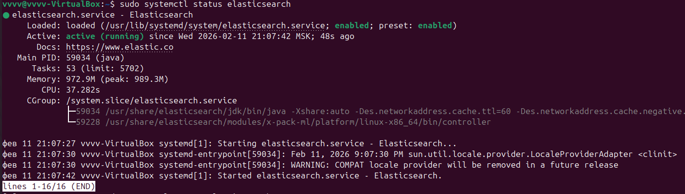
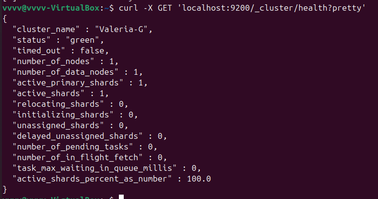
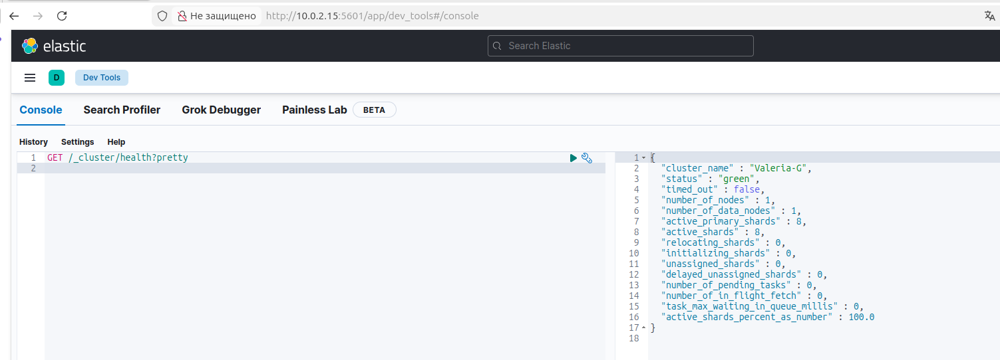
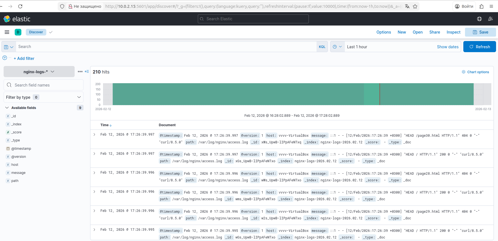
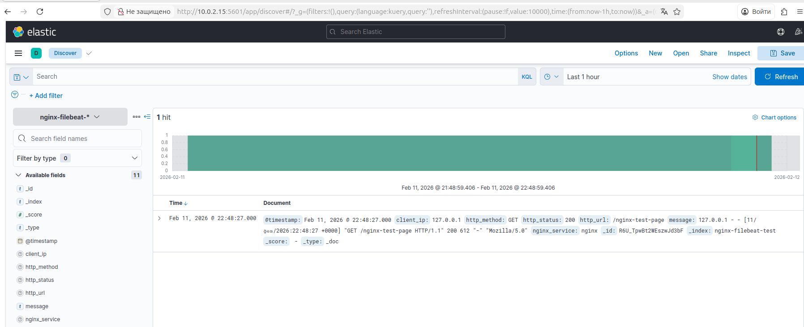

# Домашнее задание к занятию "`ELK`" - `Гаврилова Валерия`

### Задание 1

Установка elasticsearch, запуск и смена cluster_name

```
sudo apt update
sudo apt install openjdk-11-jdk -y
java -version
wget https://mirror.yandex.ru/mirrors/elastic/7/pool/main/e/elasticsearch/elasticsearch-7.17.25-amd64.deb
sudo dpkg -i elasticsearch-7.17.25-amd64.deb
sudo nano /etc/elasticsearch/elasticsearch.yml
sudo nano /etc/elasticsearch/jvm.options
sudo systemctl daemon-reload
sudo systemctl enable elasticsearch
sudo systemctl start elasticsearch
systemctl status elasticsearch
curl -X GET 'localhost:9200/_cluster/health?pretty'
```

Kонфигурационный файл elasticsearch.yml
```
cluster.name: Valeria_G
node.name: node-1
network.host: 0.0.0.0
http.port: 9200
discovery.type: single-node
xpack.security.enabled: false
```

Демонстрация работы:



Смена cluster_name:


---

### Задание 2

Листинг команд
```
cd /tmp
wget https://mirror.yandex.ru/mirrors/elastic/7/pool/main/k/kibana/kibana-7.17.25-amd64.deb
sudo dpkg -i kibana-7.17.25-amd64.deb
sudo nano /etc/kibana/kibana.yml
sudo systemctl daemon-reload
sudo systemctl enable kibana
sudo systemctl start kibana
sudo systemctl status kibana
sudo netstat -tulpn | grep 5601
```

Kонфигурационный файл kibana.yml
```
server.port: 5601
server.host: "0.0.0.0"
elasticsearch.hosts: ["http://localhost:9200"]
elasticsearch.requestTimeout: 60000
kibana.index: ".kibana"
```

Выполнение запроса GET /_cluster/health?pretty 


---

### Задание 3

Листинг команд
```
cd /tmp
wget https://mirror.yandex.ru/mirrors/elastic/7/pool/main/l/logstash/logstash-7.17.25-amd64.deb
sudo dpkg -i logstash-7.17.25-amd64.deb
sudo nano /etc/logstash/jvm.options
sudo nano /etc/logstash/conf.d/nginx.conf
sudo systemctl daemon-reload
sudo systemctl enable logstash
sudo systemctl start logstash
sudo systemctl status logstash
curl -X GET 'localhost:9200/_cat/indices?v'
```
Kонфигурационный файл nginx.conf
```
input {
  file {
    path => "/var/log/nginx/access.log"
    start_position => "beginning"
    sincedb_path => "/dev/null"
  }
}
output {
  stdout { 
    codec => rubydebug 
  }
  elasticsearch {
    hosts => ["http://localhost:9200"]
    index => "nginx-logs-%{+YYYY.MM.dd}"
  }
}
```
Итог запуска Logstash и Nginx:


---

### Задание 4


Kонфигурационный файл filebeat.yml
```
filebeat.inputs:
- type: log
  enabled: true
  paths:
    - /var/log/nginx/access.log
  fields:
    service: nginx
  fields_under_root: true

output.elasticsearch:
  hosts: ["localhost:9200"]
  index: "nginx-filebeat-%{+yyyy.MM.dd}"

setup.ilm.enabled: false
setup.template.name: "nginx-filebeat"
setup.template.pattern: "nginx-filebeat-*"
```

