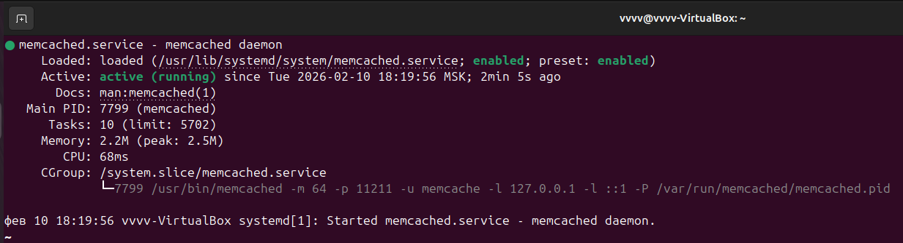
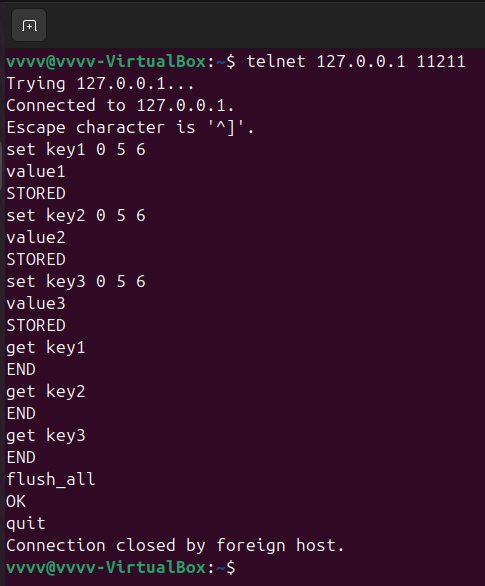
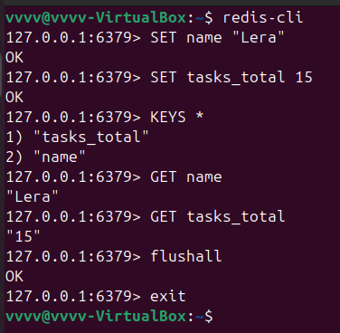

# Домашнее задание к занятию "`Кеширование Redis/memcached`" - `Гаврилова Валерия`

### Задание 1

Вот ключевые категории проблем, которые кеширование помогает решить:
1. Проблемы производительности и скорости
- Высокая задержка (latency) при доступе к данным.
- Длительные вычисления.
- «Горячие» данные (часто запрашиваемые).

2. Проблемы масштабируемости и нагрузки
- Ограниченная пропускная способность основного источника.
- Рост числа пользователей/запросов.
- Проблемы «тёплого» запуска.
  
3. Проблемы доступности и отказоустойчивости
- Частичные сбои внешних сервисов или БД.
- Повышение доступности при сетевых проблемах.

4. Проблемы экономии ресурсов и стоимости
- Высокая стоимость операций.
- Экономия вычислительных ресурсов (CPU).
- Сокращение сетевого трафика.

5. Проблемы согласованности и предсказуемости
- «Всплески» нагрузки, которые сложно предсказать.
- Улучшение пользовательского опыта (UX).

----

### Задание 2

Установка memcached
```
sudo apt update
sudo apt install memcached
sudo systemctl enable memcached
sudo systemctl start memcached
sudo systemctl status memcached
```


Демонстрация работы memcached




---

### Задание 3

Листинг команд:

```
telnet 127.0.0.1 11211
set key1 0 5 6
value1
set key2 0 5 6
value2
set key3 0 5 6
value3
get key1
get key2
get key3
flush_all
quit
```

Скриншот выполнения команд:



---

### Задание 4

Листинг команд

```
SET name "Lera"
SET tasks_total 15
KEYS *
GET name
GET tasks_total
flushall
exit
```
Скриншот выполнения команд


---

### Задание 5*

Листинг команд

```
redis-cli
scan 0
SET key5 5
INCRBY key5 5
GET key5
flushall
exit
```

Скриншот выполнения команд:
