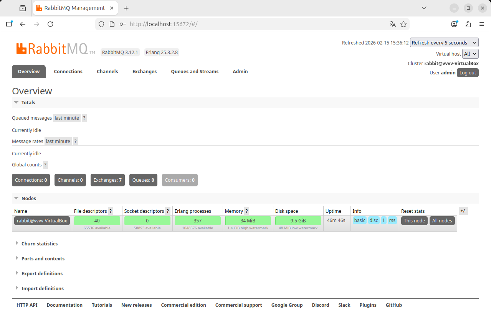
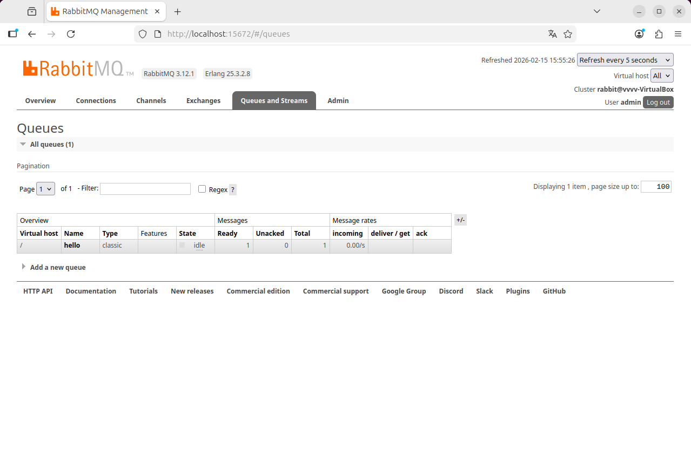
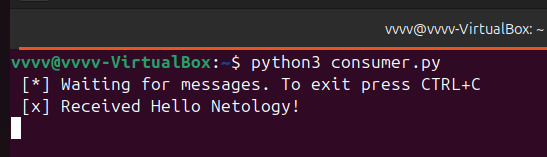
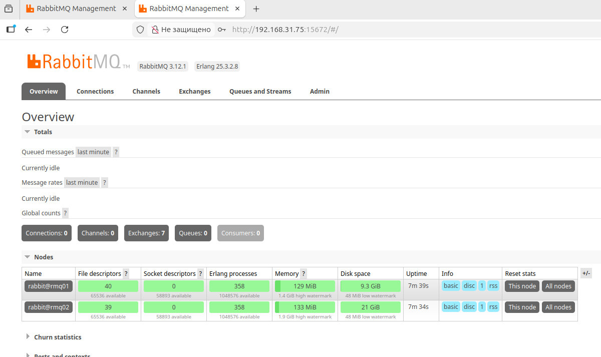
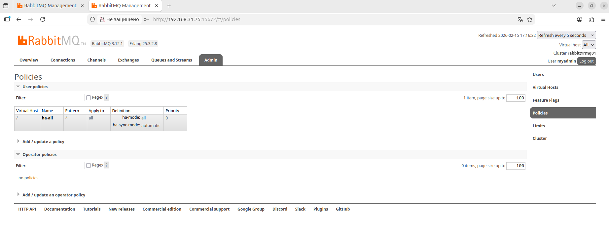
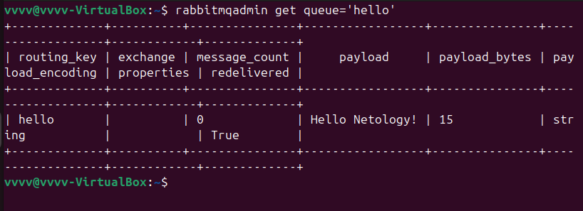

# Домашнее задание к занятию "`Очереди RabbitMQ`" - `Гаврилова Валерия`

### Задание 1

Листинг кода
```
sudo apt update && sudo apt upgrade -y
sudo apt install curl wget gnupg -y
sudo apt install erlang -y
sudo apt install rabbitmq-server -y
sudo systemctl enable rabbitmq-server
sudo systemctl start rabbitmq-server
sudo systemctl status rabbitmq-server
sudo rabbitmq-plugins enable rabbitmq_management
sudo rabbitmqctl add_user admin admin123
sudo rabbitmqctl set_user_tags admin administrator
sudo rabbitmqctl set_permissions -p / admin ".*" ".*" ".*"
```
Демонстрация работоспособности:


---
### Задание 2

Листинг кода
```
sudo apt update
sudo apt install python3 python3-pip -y
sudo apt install python3-pika -y
chmod +x producer.py consumer.py
python3 producer.py
python3 consumer.py
```

producer.py:
```
#!/usr/bin/env python3
# coding=utf-8
import pika

RABBITMQ_HOST = 'localhost'

credentials = pika.PlainCredentials('admin', 'admin123')

connection = pika.BlockingConnection(
    pika.ConnectionParameters(host=RABBITMQ_HOST, credentials=credentials)
)

channel = connection.channel()
channel.queue_declare(queue='hello')

channel.basic_publish(exchange='',
                      routing_key='hello',
                      body='Hello Netology!')

print(" [x] Sent 'Hello Netology!'")
connection.close()
```
consumer.py:
```
#!/usr/bin/env python3
# coding=utf-8
import pika

RABBITMQ_HOST = 'localhost'
credentials = pika.PlainCredentials('admin', 'admin123')

connection = pika.BlockingConnection(
    pika.ConnectionParameters(host=RABBITMQ_HOST, credentials=credentials)
)

channel = connection.channel()
channel.queue_declare(queue='hello')

def callback(ch, method, properties, body):
    print(f" [x] Received {body.decode('utf-8')}")

channel.basic_consume(queue='hello',
                      on_message_callback=callback,
                      auto_ack=True)

print(' [*] Waiting for messages. To exit press CTRL+C')
channel.start_consuming()
```
Результат работы producer.py:



consumer.py:


--- 
### Задание 3





результат на первой

